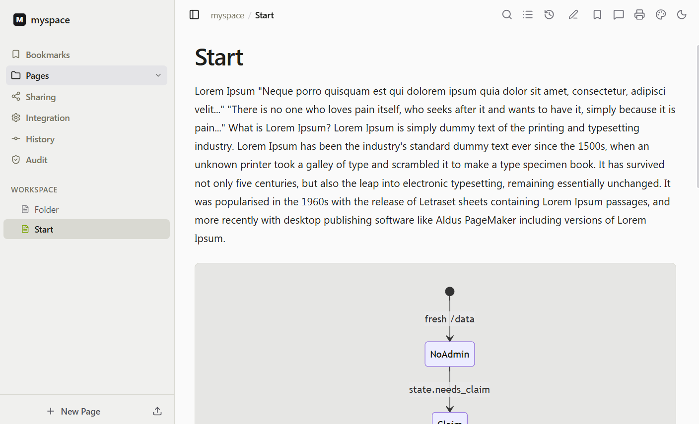
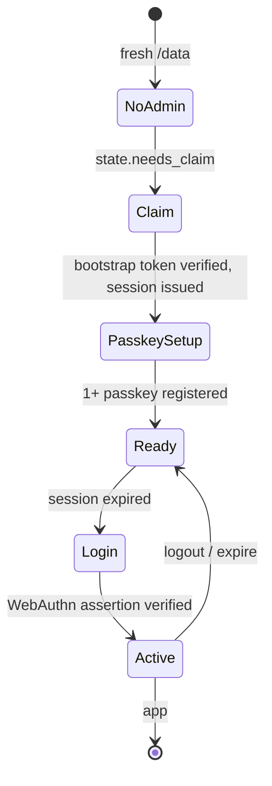
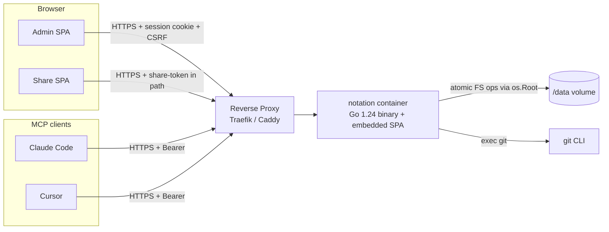

<div align="center">

# notation

**A self-hosted, single-container notes & file workspace** with flat-file storage, per-Space Git history, Magic-Link sharing, passkey auth, and a native Model Context Protocol server for Claude Code / Cursor.

[](https://go.dev)
[](https://react.dev)
[](#quick-start)
[](#mcp-integration)
[](#authentication)
[](#security)

</div>

---

<!-- TODO: replace with a real screenshot once UI is finalised -->
<div align="center">
  
  <p><em>Spaces, Markdown editor, file tree, Magic Links and MCP — all in one container.</em></p>
</div>

## Why notation?

Most note tools force you to pick a side: either a SaaS that owns your data, or a self-hosted thing that's a pain to back up. `notation` keeps everything in **plain files** under a Docker volume, versions every Space with **git**, lets you **share** individual workspaces with permissions, and exposes a **Model Context Protocol** endpoint so Claude Code (or Cursor, or any MCP-speaking client) can edit your notes directly — all behind a single binary.

```
┌───────────────────────┐    ┌──────────────────────────┐
│  Browser (admin SPA)  │    │  Claude Code / Cursor    │
│  Magic-link visitors  │    │  (MCP over HTTP+JSON-RPC)│
└──────────┬────────────┘    └────────────┬─────────────┘
           │                              │
           └──────────────┬───────────────┘
                          ▼
                ┌──────────────────────┐
                │  notation container  │
                │  Go 1.24 + Vite SPA  │
                └──────────┬───────────┘
                           ▼
              /data/spaces/<id>/
                 ├── files/       ← user content (git-versioned)
                 │   └── .git/
                 └── .notation/   ← shares.json, mcp-tokens.json,
                                    comments.jsonl, audit.log,
                                    admin.json, server-secret
```

## Table of contents

- [Features](#features)
- [Quick start](#quick-start)
- [Configuration](#configuration)
- [Authentication](#authentication)
- [Spaces & Git versioning](#spaces--git-versioning)
- [Magic Links](#magic-links)
- [Local folder sync](#local-folder-sync)
- [MCP integration](#mcp-integration)
- [Supported file types](#supported-file-types)
- [Markdown features](#markdown-features)
- [Zero-knowledge encryption](#zero-knowledge-encryption)
- [Themes](#themes)
- [Keyboard shortcuts](#keyboard-shortcuts)
- [Security](#security)
- [Backup & recovery](#backup--recovery)
- [Development](#development)
- [Architecture](#architecture)
- [License](#license)

---

## Features

<table>
<tr>
<td width="50%">

### 🗂️  Spaces

Each Space is a folder on disk with its own git repo. Auto-commit on save, manual snapshots, restore any past version side-by-side via Monaco diff editor.

</td>
<td>

### ✍️  Notion-grade editor

Monaco-based Markdown editor with toolbar, `[[wiki-link]]` picker, custom context menu, line numbers, selection toolbar, and `Cmd/Ctrl + K` command palette.

</td>
</tr>
<tr>
<td>

### 🔗  Magic Links

Share a Space with **read**, **comment** or **edit** permission. Optional expiry. Tokens hashed at rest, rate-limited, audit-logged.

</td>
<td>

### 🔑  Passkey auth

WebAuthn-first sign-in. Bootstrap token printed to stderr on first boot, single-use claim, then passkeys take over. Optional Authelia mode.

</td>
</tr>
<tr>
<td>

### 🧠  MCP server

Native HTTP MCP endpoint per Space. Bearer-token auth. Ships with `read_file`, `write_file`, `grep`, `glob`, `outline`, `git_log`, … so Claude can navigate intelligently.

</td>
<td>

### 📊  Universal viewer

Markdown, code (syntax-highlighted), images, PDF, video, audio, XLSX, DOCX, CSV — all in-browser, lazy-loaded, sanitised.

</td>
</tr>
<tr>
<td>

### 💬  Anchored comments & reactions

Select text → pin a comment or an emoji reaction to that exact quote. Annotated passages carry a visible badge; hover one to read the thread and reply without leaving the page.

</td>
<td>

### 🛡️  Hardened by default

`os.Root` sandbox, strict CSP, rehype-sanitize, CSRF tokens, per-IP rate limits, audit log with hash-chain integrity.

</td>
</tr>
<tr>
<td>

### 🔒  Zero-knowledge encryption

Encrypt a Space end-to-end in your browser: the server keeps ciphertext and opaque ids — not your contents, not even the file names. Per Space, reversible, with a one-time recovery key.

</td>
<td>

### 📂  Local folder sync

Pull a Space into a real folder, work on it with local tools or a coding agent, push the changes back through a reviewed 3-way diff. Works for plaintext and encrypted Spaces alike.

</td>
</tr>
</table>

---

## Quick start

### Docker (one-liner)

```bash
docker run -d --name notation \
  -p 8080:8080 \
  -v $PWD/notation-data:/data \
  -e NOTATION_BASE_URL="https://notes.example.com" \
  ghcr.io/atomfritte/notation:latest   # or: build the image locally
```

Watch the logs for the **bootstrap token banner**, then open the URL in your browser:

```bash
docker logs notation
```

```
═══════════════════════════════════════════════════════════════════
  🔑  notation — admin bootstrap token (one-time, rotates per boot)
═══════════════════════════════════════════════════════════════════

      Sw7Yk2-Bf3pQ8x_Lm9R4tHnGc6vAj1eUoZ_5KdMyXbN

  Open https://notes.example.com and paste the token to claim the
  admin account. Once you register a passkey, future restarts won't
  print a token.
═══════════════════════════════════════════════════════════════════
```

Paste it on the **Claim** screen → register a passkey → you're in.

### Docker Compose

```yaml
services:
  notation:
    image: ghcr.io/atomfritte/notation:latest
    restart: unless-stopped
    ports:
      - "8080:8080"
    volumes:
      - ./notation-data:/data
    environment:
      NOTATION_BASE_URL: "https://notes.example.com"
      NOTATION_TRUST_PROXY: "1"   # set if behind Traefik/Caddy/nginx
```

### Build from source

```bash
git clone https://github.com/atomfritte/notation.git
cd notation
docker build -t notation:local .
docker run -d --name notation -p 8080:8080 -v $PWD/data:/data notation:local
```

### Updating (Compose)

For the `docker-compose.yml` deployment (app + optional Kokoro voice sidecar),
`scripts/update.sh` recompiles and restarts the containers from source:

```bash
./scripts/update.sh              # git pull, rebuild image(s), recreate containers
./scripts/update.sh notation     # only the app (skip the kokoro sidecar)
./scripts/update.sh --no-cache   # force a clean rebuild
./scripts/update.sh --no-pull    # rebuild the current checkout
```

The frontend and Go binary are compiled inside the Dockerfile, so a rebuild is a
full recompile. Your data volume and the downloaded Kokoro model
(`./kokoro-models`) are left untouched.

---

## Configuration

All configuration is via environment variables. None are required for a basic local run.

### Core

| Variable | Default | Description |
|---|---|---|
| `NOTATION_BIND` | `:8080` | Listen address. |
| `NOTATION_DATA_DIR` | `/data` | Where Spaces, auth records, audit logs live. Mount as a volume. |
| `NOTATION_BASE_URL` | *(empty)* | Public URL of the deployment. Used for share URLs, derives the WebAuthn `rp_id`, and tells the server when to mark cookies `Secure`. |
| `NOTATION_COOKIE_SECURE` | *(empty)* | Override the session cookie's `Secure` flag: `1` = always, `0` = never (plain-HTTP LAN). Unset: `Secure` unless `NOTATION_BASE_URL` starts with `http://` — fail-safe for TLS-proxy setups that never set a base URL. |
| `NOTATION_MAX_UPLOAD_BYTES` | `67108864` (64 MiB) | Per-file upload limit. |
| `NOTATION_COMMIT_DEBOUNCE_MS` | `5000` | Window during which subsequent saves coalesce into one git commit. |

### Routing

| Variable | Default | Description |
|---|---|---|
| `NOTATION_SHARE_PATH` | `/s` | URL prefix for the Magic-Link app + assets. Must be Authelia-bypassed if you put Authelia in front. |
| `NOTATION_MCP_PATH` | `/mcp` | URL prefix for the MCP HTTP endpoints. Also Authelia-bypass. |

### Authentication

| Variable | Default | Description |
|---|---|---|
| `NOTATION_AUTH_MODE` | `session` | One of `session` (notation's own passkey + cookie auth), `authelia` (trust `Remote-User`), or `both` (defense-in-depth). |
| `NOTATION_RP_ID` | derived from `NOTATION_BASE_URL` | WebAuthn relying-party id (the bare host). Passkeys are bound to this — changing it invalidates all registered credentials. |
| `NOTATION_SESSION_LIFETIME_HOURS` | `720` | Session cookie lifetime in hours (default 30 days). |
| `NOTATION_TRUST_PROXY` | `0` | Set to `1` when behind a header-rewriting reverse proxy; otherwise `X-Forwarded-For` is ignored to prevent IP spoofing. |
| `NOTATION_ADMIN_HEADER` | `Remote-User` | Authelia header name. Only used when `AUTH_MODE` includes `authelia`. |
| `NOTATION_ADMIN_GROUPS_HEADER` | `Remote-Groups` | Authelia groups header. |
| `NOTATION_ADMIN_GROUP` | *(empty)* | If set, the user must be a member of this group. |
| `NOTATION_DEV_BYPASS_AUTH` | `0` | **Do NOT set in production.** Bypasses all auth, intended only for local Vite-against-backend development. |

### Behind a reverse proxy

`notation` works fine standalone, but a typical deployment puts it behind Traefik / Caddy / nginx for TLS termination.

```yaml
# Traefik labels — adjust the hostname
labels:
  - "traefik.enable=true"
  - "traefik.http.routers.notation.rule=Host(`notes.example.com`)"
  - "traefik.http.routers.notation.entrypoints=websecure"
  - "traefik.http.routers.notation.tls.certresolver=le"
  - "traefik.http.services.notation.loadbalancer.server.port=8080"
```

If you keep Authelia (perimeter SSO) **and** want notation's own session layer, set `NOTATION_AUTH_MODE=both`. The Magic-Link path (`/s/*`) and MCP path (`/mcp/*`) must always bypass Authelia — they have their own token auth.

---

## Authentication

notation runs through a small state machine on every page load:



### Bootstrap

- On every boot, if no admin is yet **claimed**, a 32-byte random token is generated, hashed (SHA-256) and printed to **stderr** in a banner.
- The token **rotates on every restart** until claimed, so the most recent container log always shows the live one.
- Claim is rate-limited: **10 failures per IP locks for 1 hour**. Constant-time hash compare.

### Passkeys (WebAuthn)

- Powered by [`go-webauthn`](https://github.com/go-webauthn/webauthn) (server) and [`@simplewebauthn/browser`](https://simplewebauthn.dev/) (client).
- Discoverable-credential flow: the browser shows the system passkey picker. No usernames, no passwords.
- Multiple passkeys per admin. **You cannot delete the last one** (would lock you out).
- Sessions are HMAC-signed cookies (`HttpOnly`, `Secure`, `SameSite=Strict`), 30-day sliding window. CSRF token lives inside the cookie payload and is verified via the `X-CSRF-Token` header.

### Lost passkey recovery

```bash
docker exec -it notation rm /data/.notation/admin.json
docker restart notation
docker logs notation     # ← new bootstrap token in the banner
```

Spaces, Magic Links, MCP tokens, and audit logs are untouched.

---

## Spaces & Git versioning

A Space is a folder under `/data/spaces/<id>/`. The structure is intentionally simple:

```
/data/spaces/<id>/
├── files/                  ← everything users see
│   ├── .git/
│   ├── note.md
│   └── attachments/
│       └── pic.png
└── .notation/              ← server-side metadata
    ├── meta.json
    ├── shares.json         (hashed)
    ├── mcp-tokens.json     (hashed)
    ├── comments.jsonl
    └── audit.log           (hash-chained)
```

- **Auto-commit** on save with a 5-second debounce window. Subsequent edits within the window become one commit.
- The git repo lives **inside `files/`** so `.notation/` (secrets, audit) never enter version history.
- The author of each commit identifies the source: `admin:<name>` / `guest:<share-id>` / `mcp:<token-id>`.
- **Per-file history viewer** in the admin UI: pick two commits, see a Monaco side-by-side diff; pick one, get a single-click **Restore**.

---

## Magic Links

Click the **Sharing** tab in any Space → create a link with a permission level, an optional **scope** (a single page or folder), and optional expiry.

| Permission | Can read | Can comment | Can edit |
|---|---|---|---|
| `read`    | ✅ | — | — |
| `comment` | ✅ | ✅ | — |
| `edit`    | ✅ | ✅ | ✅ |

- **Scoped links**: leave the scope empty to share the whole Space, or set it to a page (`notes/weekly.md`) or folder (`notes/`). Guests only ever see that subtree — tree, file access, search, comments and forms are all enforced server-side against the scope; requests outside it get a 403 and an audit entry. A page that embeds attachments from outside its scope will show them blocked — share the folder instead.
- Tokens are 32 random bytes (base64url, ~43 chars), **only their SHA-256 hash is persisted**.
- Constant-time lookup across Spaces.
- Path `<NOTATION_SHARE_PATH>/<token>` — Authelia-bypassed.
- Per-IP rate limit (5 rps avg, 20 burst).
- Every action is appended to the Space's `audit.log` with the actor `share:<id>:<perm>`.

The viewer at the share URL is the same React app as the admin's, in **read-only / comment / edit** mode depending on permission. Visitors get the same Markdown viewer (Mermaid, KaTeX, syntax highlight), file-type previews, anchored comments, threaded replies.

---

## Local folder sync

Work on a Space with local tools — an editor, a script, a coding agent — and bring the result back under review. Open a Space → **Local folder sync** (the header's folder icon, or the file-tree context menu), pick a directory, and you get two explicit actions. There is no live auto-sync: nothing moves without a click.

| Action | What it does |
|---|---|
| **Pull** | Writes every file of the Space into the folder, recreating the tree (empty folders included). Files already in the folder that the Space doesn't know about (a `.git`, scratch files) are left alone. |
| **Push** | Reads the folder back, diffs it, shows a change preview (new / modified / deleted / conflict) and applies it only when you confirm. Deletions are opt-in via a separate checkbox. |

- **Works for every Space** — plaintext or zero-knowledge encrypted. For an encrypted Space the browser decrypts on pull and re-encrypts on push; the server never sees anything but ciphertext. The panel says so plainly, because pull does write *decrypted* files to your disk.
- **A plaintext Space's push is an ordinary write**, so every pushed file lands in the Space's git history like any other edit.
- **3-way diff, not last-writer-wins.** A `.notation-sync.json` manifest (`path → content hash`) is written into the folder at every successful sync. It's what separates "the folder added a file" from "the Space deleted one", and it flags a real conflict when both sides changed the same file since the last sync (resolution is folder-wins, and every conflict is listed before you confirm).
- **Ignored on both sides**: dotfiles and dot-directories (`.git`, `.env`, the manifest itself) and any `node_modules/`.
- **A failed write doesn't poison the baseline.** If the server rejects a file (too large, connection lost), the push still applies everything else, reports what failed, and keeps those paths out of the sync record so the next push retries them.
- **Requirements**: a Chromium-based browser (Chrome, Edge, Brave) over https or localhost — it uses the File System Access API. The picked folder is remembered per Space in IndexedDB; you only re-grant permission with one click. No encryption key is ever stored there.

---

## MCP integration

Each Space exposes an HTTP+JSON-RPC **Model Context Protocol** endpoint at `<NOTATION_MCP_PATH>/<space-id>`. Auth is `Authorization: Bearer <token>`. Tokens are scoped to one Space.

### Adding to Claude Code

```bash
claude mcp add notation-myspace "https://notes.example.com/mcp/myspace" \
  --transport http \
  --scope project \
  --header "Authorization: Bearer <token>"
```

Or paste into `.mcp.json`:

```json
{
  "mcpServers": {
    "notation-myspace": {
      "type": "http",
      "url": "https://notes.example.com/mcp/myspace",
      "headers": { "Authorization": "Bearer <token>" }
    }
  }
}
```

### Adding to Cursor

`~/.cursor/mcp.json` (global) or `.cursor/mcp.json` (project):

```json
{
  "mcpServers": {
    "notation-myspace": {
      "url": "https://notes.example.com/mcp/myspace",
      "headers": { "Authorization": "Bearer <token>" }
    }
  }
}
```

### Raw curl (debugging)

```bash
curl -X POST "https://notes.example.com/mcp/myspace" \
  -H "Authorization: Bearer <token>" \
  -H "Content-Type: application/json" \
  -d '{"jsonrpc":"2.0","id":1,"method":"tools/list"}' | jq
```

### Available tools

| Tool | Purpose |
|---|---|
| `list_files`  | Flat list of files with size + modtime |
| `get_tree`    | Nested directory tree as JSON |
| `glob`        | Find paths matching `**/*.md` etc. |
| `outline`     | Heading outline of a markdown file (level + line) |
| `map`         | Structure map of the whole Space — every markdown file with its headings, no body text |
| `read_file`   | Full file contents |
| `write_file`  | Create or overwrite (auto-commit on save) |
| `create_file` | Atomic create — fails if exists |
| `delete_file` | Remove a file |
| `rename_file` | Move / rename within the Space |
| `mkdir`       | Create a directory |
| `search`      | Case-insensitive substring search |
| `grep`        | Regex search with `**` glob + N lines of context |
| `git_log`     | Recent commits |
| `git_diff`    | Diff of one commit by hash |
| `forms_guide` | Full manual for authoring a Form (`_form.md` syntax + field types) |

Generate a token from the **Integration** tab in the admin sidebar — the modal also shows ready-to-copy snippets for Claude Code, Cursor, and a raw curl call.

> ⚠️ Tokens are shown **once** at creation. Save them; we only store the hash.

---

## Supported file types

| Extension | View | Edit | Notes |
|---|---|---|---|
| `.md` `.markdown` `.mdx` | Markdown viewer (Mermaid, KaTeX, syntax highlight, wiki-links, anchored comments) | CodeMirror | Default for new pages |
| `.png` `.jpg` `.jpeg` `.gif` `.webp` `.avif` `.bmp` `.ico` | `` inline | — | Range-served |
| `.svg` | Download (inline disabled for security) | — | XSS-protective |
| `.pdf` | `<iframe>` browser PDF viewer | — | |
| `.mp4` `.webm` `.mov` `.m4v` `.ogv` | `<video controls>` with Range/seek | — | http.ServeContent on the backend |
| `.mp3` `.wav` `.ogg` `.m4a` `.aac` `.flac` `.opus` | `<audio controls>` | — | |
| `.xlsx` `.xls` `.ods` `.csv` `.tsv` | SheetJS table view (multi-sheet tabs) | CodeMirror (CSV/TSV only) | DOMPurify-sanitised, lazy chunk |
| `.docx` | Mammoth → semantic HTML in `.prose` styling | — | DOMPurify-sanitised, lazy chunk |
| `.json` `.yaml` `.ts` `.go` `.py` `.rs` `.sh` `.sql` … | highlight.js code view | CodeMirror | 30+ languages |
| anything else | Download link | — | Forced `attachment` disposition |

---

## Markdown features

The viewer is the same on the admin side and through Magic Links.

- **Wiki-links**: `[[other-page]]`, `[[other-page#section]]`, `[[other-page|display text]]`
- **Heading anchors**: every heading is linkable, `rehype-slug`-generated ids match what the editor's picker inserts
- **Mermaid**: fenced code with `mermaid` language, lazy-loaded
- **KaTeX**: `$inline$` and `$$display$$` math
- **Syntax highlight**: `rehype-highlight` with the github-dark theme
- **Code-block Copy button**: hover any code block
- **Anchored comments**: select text → floating Comment button → the comment is pinned to that quote
- **Emoji reactions**: same selection toolbar → React → an emoji pinned to the passage, no thread needed
- **Inline annotation badges**: every annotated passage is marked in the prose and carries a trailing badge (each reaction emoji, plus `💬` and a count for comments) — you can always see where the conversation is without opening a panel
- **Hover bubble**: hovering a marked passage shows the whole thread; clicking it pins the bubble so you can reply right there. The comments column never opens itself — you decide when it's visible
- **Click to jump**: clicking a comment (in the sidebar or the all-comments panel) scrolls to its passage and keeps it highlighted; merely hovering only lights it up, it never yanks the page around
- **Threaded replies**: one level deep, indented — from the sidebar or from the in-document bubble
- **Outline / TOC**: sidebar panel with IntersectionObserver-driven active-section tracking
- **Backlinks**: which other files link here (backed by the `search` tool)

---

## Zero-knowledge encryption

Any Space can be **encrypted end-to-end in your browser**, turning the server into a zero-trust store: it holds ciphertext and nothing else. Use it for the Spaces that hold the sensitive things; leave the rest plaintext and keep the server-side features. It is a per-Space choice, switchable in both directions.

Open a Space → **Encrypt this Space** (the lock icon in the sidebar footer, or the file-tree context menu) → pick a password. Every file is re-encrypted client-side, the plaintext content **and its git history are erased**, and you get a one-time recovery key. Decrypting later reverses it.

**What the server can and cannot see**

| Sees | Never sees |
|---|---|
| Opaque ciphertext blobs | File contents |
| Opaque node ids and an ordering counter | File and folder names, the tree shape |
| The Space's id, display name and timestamps | Comments, reactions, search queries |
| How much data there is, and when it changed | Your password, the key, the recovery key |

- **The browser is the only place a key exists.** A random 256-bit data key encrypts the content; that key is wrapped under a key derived from your password with Argon2id (64 MiB, t=3) and, independently, under the recovery key. The unlocked key lives in memory in a dedicated Web Worker for the session only — never in localStorage, never in a cookie, never sent anywhere. Closing the tab (or **Lock Space**) drops it.
- **There is no password reset.** The recovery key is the only other way in, it is shown exactly once, and it is stored nowhere. Write it down.
- **Names and paths stay secret too**, not just contents: the file tree is a CRDT op-log of encrypted operations, files are addressed by opaque node id (so a URL or an access log never carries a page name), and the client keeps its local state — bookmarks, scroll positions, the collapsed-folder map — keyed by those same ids.
- **Integrity, not just secrecy**: every operation is sealed with AES-256-GCM binding its own id, ordering counter and author as additional data, so the server cannot forge, reorder or splice operations undetected. It *can* still withhold recent ones — a hash-chained head is future work, tracked in the design notes.
- **What still works**: the editor, wiki-links, backlinks, full-text search (client-side over the decrypted corpus), comments and reactions (encrypted into the op-log), the on-device read-aloud voice, whole-Space PDF, decrypted ZIP export, and [local folder sync](#local-folder-sync).
- **What is off**: Magic Links, the MCP server, git version history, server-side search and the server's studio TTS voice — every one of them would need the plaintext. The UI hides them rather than failing at the point of use.

---

## Themes

Every theme ships a full palette for **both** light and dark mode; the palette editor (Accent colour in the header) lets you edit each token, import a VS Code theme, and save your own.

Beyond the accent tints and the editor classics (Dracula, Monokai, Solarized, Nord, Gruvbox, Tokyo Night, Catppuccin), there are four **split-tone** themes — **Studio**, **Manuscript**, **Evergreen** and **Nocturne** — where the chrome and the reading area deliberately don't share a tone: in light mode a deep, quiet sidebar frames a near-paper page; in dark mode it inverts and the page is lifted out of an almost-black frame. Body text clears 9:1 contrast on both surfaces.

That split is one palette token, `chromeBg`, so you can build your own: set the **Chrome background** swatch apart from **Elevated surface**. Chrome (sidebars, header, outline + comments panels, palettes) follows the first; cards, inputs, popovers and file viewers inside the content area follow the second — which is why a text field in a dialog never ends up dark-on-dark. Leave them equal for a uniform theme.

---

## Keyboard shortcuts

| Shortcut | Action |
|---|---|
| `Cmd` / `Ctrl` + `K` | Jump-to-page palette (fuzzy match across the Space) |
| `Cmd` / `Ctrl` + `Shift` + `F` | Full-text search modal |
| `Cmd` / `Ctrl` + `\` | Toggle sidebar |
| `Alt` + `N` | New page |
| `Cmd` / `Ctrl` + `S` | Save current edit |
| `Cmd` / `Ctrl` + `B` | Bold (editor) |
| `Cmd` / `Ctrl` + `I` | Italic (editor) |
| `Cmd` / `Ctrl` + `E` | Highlight current selection (editor) |
| `[[` | Open the wiki-link picker (in editor) |

---

## Security

Security is a first-class concern. The design assumes both **multi-actor** (different Magic-Link visitors, MCP clients writing files) **and** **defense in depth**.

### File-system sandbox

Every file op (`read_file`, `write_file`, `delete`, `rename`, …) goes through Go 1.24's `os.Root` — a kernel-level sandbox that refuses path escapes via `..` and won't follow symlinks out of the Space. `SafeJoin` still runs first for string-level validation (`..`, NUL bytes, dotfiles, backslashes).

### Content-Security-Policy

```
default-src 'self';
script-src 'self' 'wasm-unsafe-eval';
style-src 'self' 'unsafe-inline';
img-src 'self' data: blob:;
font-src 'self' data:;
connect-src 'self';
media-src 'self' blob:;
worker-src 'self' blob:;
frame-src 'self';
frame-ancestors 'self';
base-uri 'self';
form-action 'self';
object-src 'none';
```

### HTML sanitisation

- **Markdown**: `rehype-sanitize` runs **after** `rehype-raw`, with a tight allowlist (`<mark>`, `<details>`, `<summary>`, `<kbd>`, `<sub>`, `<sup>`).
- **DOCX & XLSX**: parsed client-side, then output runs through `DOMPurify` with explicit tag/attribute allowlists before any `dangerouslySetInnerHTML`.

### Authentication

- Bootstrap token: 32-byte CSPRNG, SHA-256 stored, constant-time compare, rate-limited, lockout after 10 failed attempts.
- Sessions: HMAC-SHA256 signed cookies with a CSRF token in the payload. `HttpOnly`, `Secure` (HTTPS deploys), `SameSite=Strict`.
- WebAuthn passkeys for everyday login. Per-IP rate limit + lockout on login.

### CSRF

All state-changing admin / auth requests check `X-CSRF-Token` against the value embedded in the signed session cookie. GET/HEAD/OPTIONS are exempt.

### Audit log

JSONL per Space, **hash-chained** (each entry's `prev_hash` = SHA-256 of the previous line). Tampering breaks the chain — `AuditLog.Verify` will flag the first line that doesn't match.

### Uploaded files

Non-text, non-image, non-PDF, non-media MIMEs are served with `Content-Disposition: attachment` + `application/octet-stream`. `X-Content-Type-Options: nosniff` everywhere. HTML / SVG can't render inline from a user upload.

### Token-in-URL leak

The request logger redacts 43-char base64url tokens out of `/s/*` and `/mcp/*` paths before writing to stdout, so docker logs never contain a live share or MCP token.

### Rate limits

| Endpoint group | Limit |
|---|---|
| `/s/api/*` (share) | 5 rps avg, burst 20, per IP |
| `/mcp/*`           | 5 rps avg, burst 20, per IP |
| `/api/admin/*`     | 50 rps avg, burst 200, per IP |
| `/api/auth/claim` | hard lockout after 10 fails (1 h) |
| `/api/auth/passkey/login/*` | same |

### What we trust

- The reverse proxy strips client-supplied `X-Forwarded-For` headers before forwarding (otherwise set `NOTATION_TRUST_PROXY=0`).
- The container's filesystem is not shared with untrusted processes.
- Browsers honour CSP (any major modern one).

---

## Backup & recovery

Everything is in `/data`. To back up:

```bash
docker stop notation
tar czf notation-backup-$(date +%F).tar.gz -C /path/to notation-data/
docker start notation
```

To migrate to a new host: copy the tarball over, extract into the mounted volume on the new host, start the container. The bootstrap token will not be re-issued (the admin record is intact). Sign in with your registered passkey on the new domain — note that **passkeys are bound to the original `rp_id`**, so the new host must serve from the same hostname (or you'll need to re-bootstrap).

To reset just the admin (keep all Spaces / shares / MCP tokens):

```bash
rm /data/.notation/admin.json
docker restart notation
```

---

## Development

### Local dev (without docker)

```bash
# Backend
cd backend
go mod tidy
NOTATION_DATA_DIR=./.data NOTATION_DEV_BYPASS_AUTH=1 go run ./cmd/notation
```

```bash
# Frontend (separate terminal)
cd frontend
npm install
npm run dev
```

Visit `http://localhost:5173/` — Vite proxies API calls to the Go backend on `:8080`. With `NOTATION_DEV_BYPASS_AUTH=1` you skip the bootstrap + passkey flow entirely (a fake `dev-admin` session is injected).

### Tests

```bash
cd backend && go test ./...
```

### Project layout

```
notation/
├── backend/
│   ├── cmd/notation/main.go       ← entry point + startup banner
│   └── internal/
│       ├── auth/                  ← Authelia header parsing (legacy mode)
│       ├── authstore/             ← admin.json + server-secret on disk
│       ├── config/                ← env-var loader + RPID derivation
│       ├── gitrepo/               ← per-Space git wrapper (auto-commit)
│       ├── http/                  ← chi router, middleware, handlers
│       │   ├── admin.go           ← admin REST API
│       │   ├── share.go           ← magic-link REST API
│       │   ├── webauthn.go        ← passkey ceremonies
│       │   ├── authhandlers.go    ← /state, /claim, /logout
│       │   ├── files.go           ← write-file response helper
│       │   ├── middleware.go      ← request log, CSP, security headers
│       │   ├── csrf.go            ← double-submit CSRF middleware
│       │   ├── session.go         ← HMAC-signed cookie issue/verify
│       │   └── router.go          ← route registration
│       ├── mcphandler/            ← MCP JSON-RPC server + tool dispatch
│       ├── mcptoken/              ← MCP bearer-token store
│       ├── share/                 ← magic-link store + audit log + limiter
│       └── space/                 ← Space CRUD, file ops via os.Root,
│                                   grep / glob / outline
├── frontend/
│   └── src/
│       ├── admin/
│       │   ├── components/        ← FileTree, MarkdownView, Editor,
│       │   │                        AuthGate, HistoryView, …
│       │   ├── components/viewers/← SpreadsheetView, WordView,
│       │   │                        VideoView, AudioView
│       │   ├── components/auth/   ← Claim, PasskeySetup, PasskeyLogin
│       │   ├── lib/               ← api.ts, auth.ts, fileTypes.ts
│       │   └── pages/SpaceView.tsx
│       └── share/                 ← read-only / share-aware app shell
├── Dockerfile                     ← multi-stage build
└── docker-compose.example.yml
```

---

## Architecture



The Go binary serves:

- the React SPA bundle (embedded via `go:embed`),
- the admin REST API (`/api/admin/*`, session + CSRF),
- the auth API (`/api/auth/*`, bootstrap + passkey),
- the share API (`/s/api/<token>/*`),
- the MCP endpoint (`/mcp/<space-id>`, Bearer auth, JSON-RPC 2.0).

Everything is a single `net/http` server. No daemon, no database, no message broker.

---

## License

MIT — see [`LICENSE`](LICENSE) for the full text.

---

## Acknowledgments

Built on the shoulders of:

- [chi](https://github.com/go-chi/chi) — Go HTTP router
- [go-webauthn](https://github.com/go-webauthn/webauthn) — WebAuthn server
- [@simplewebauthn/browser](https://simplewebauthn.dev/) — WebAuthn client
- [React](https://react.dev) + [Vite](https://vite.dev) + [Tailwind](https://tailwindcss.com)
- [Monaco Editor](https://microsoft.github.io/monaco-editor/) — both the markdown editor and the side-by-side diff view
- [SheetJS](https://sheetjs.com/) — XLSX parsing
- [Mammoth.js](https://github.com/mwilliamson/mammoth.js) — DOCX → HTML
- [Mermaid](https://mermaid.js.org/) + [KaTeX](https://katex.org/) — diagrams & math
- [rehype](https://github.com/rehypejs) + [remark](https://github.com/remarkjs) — markdown pipeline
- [DOMPurify](https://github.com/cure53/DOMPurify) — HTML sanitiser
- [lucide-react](https://lucide.dev/) — icons

---

<div align="center">
  <sub>Built for people who want their notes on their server, accessible to the AI they actually use.</sub>
</div>
